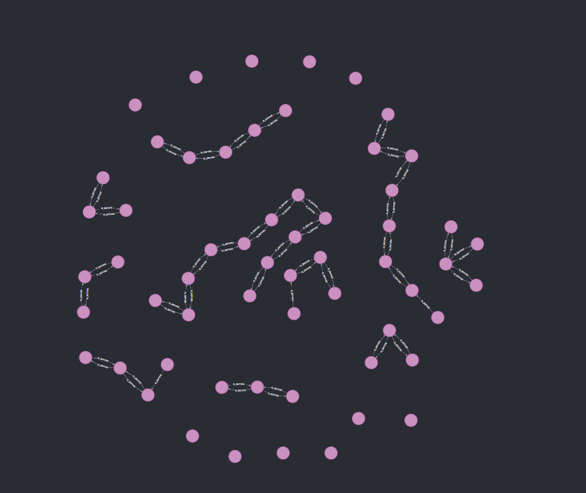
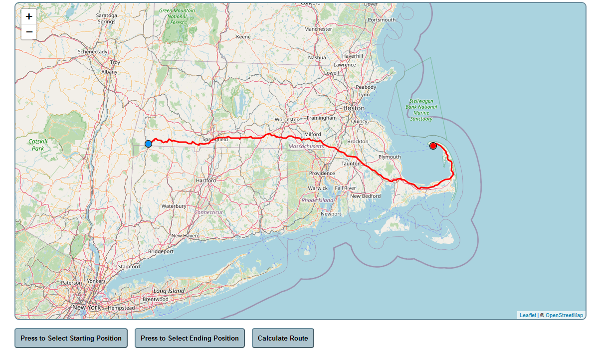
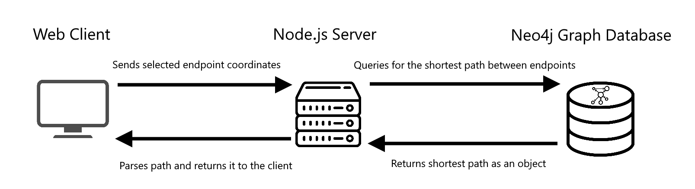

# OpenStreetMaps-GPS
 
### Phase 1: Python Demo
___
This short Python script was an exploration of the process behind the GPS. The intent of the program was to understand what would be required by a program which would be made later, and be capable of route finding over larger distances.

This program downloads street data via the OpenStreetMaps Overpass API, stores it within a graph data structure, then runs Djikstra's algorithm, using the geographic distance between two points as the heuristic, to find the shortest path from one node to another. The script then displays the found route on a map in an HTMl webpage.

If two points are far away from one another, this program takes too long to complete, as it has to download too much data to calculate the route. To solve this problem future renditions will use a graph database to store the downloaded street data to remove the need for downloading the data every time the user searches a route.

### Phase 2: Neo4j Graph Database
___

Using a graph database to store the graph data structure allows the program to more easily find the shortest path to the destination node, for datasets with many more nodes. In the example provided, the database facilitates pathfinding between any two nodes in Massachusetts, however larger numbers of nodes are possible with longer up front import times.

### Phase 3: Web client and Backend
___

A web client allows the user to select coordinates on a map, and sends those coordinates to the back end which queries the database to determine the shortest route. The calculated route is returned to the web client, and the path is displayed on a map.

### Overview

#### Web Client

Displays a map that allows the user to select start and end points. When the user presses "Calculate Route", a request is sent with the selected coordinates to the Node.js server.

When the Node.js server returns the shortest path, the web client displays it on the map, between the two end points.

#### Node.js Server

Receives coordinates from the web client and constructs a query which is sent to the Neo4j database once connected. 

When the Neo4j database returns the shortest possible path, the Node.js server parses the output, and returns it to the web client.

#### Neo4j Graph Database

Receives query from Node.js server, and runs Djikstra's path algorithm to determine the shortest path.

When the path is found, it returns the nodes along the path to the Node.js server.