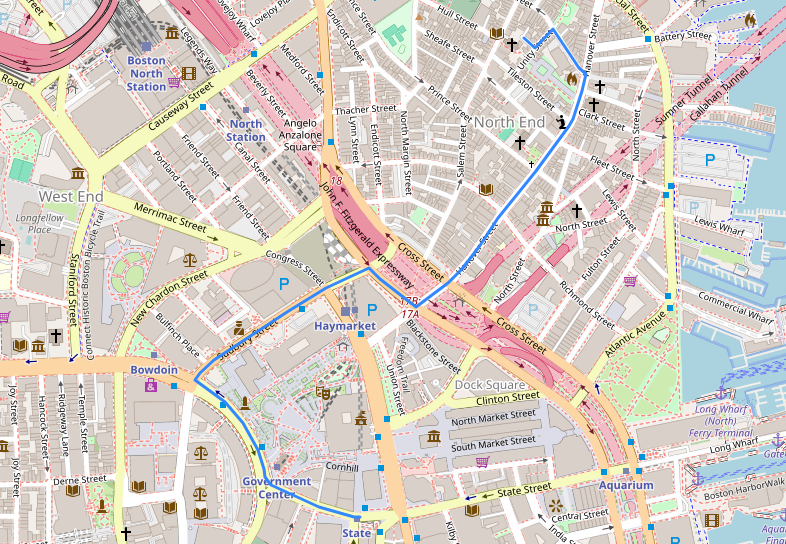

# OpenStreetMaps-GPS
 
### Phase 1: Python Demo
___
This short Python script was an exploration of the process behind the GPS. The intent of the program was to understand what would be required by a program which would be made later, and be capable of route finding over larger distances.

This program downloads street data via the OpenStreetMaps Overpass API, stores it within a graph data structure, then runs Djikstra's algorithm, using the geographic distance between two points as the heuristic, to find the shortest path from one node to another. The script then displays the found route on a map in an HTMl webpage.

If two points are far away from one another, this program takes too long to complete, as it has to download too much data to calculate the route. To solve this problem future renditions will use a graph database to store the downloaded street data to remove the need for downloading the data every time the user searches a route.

